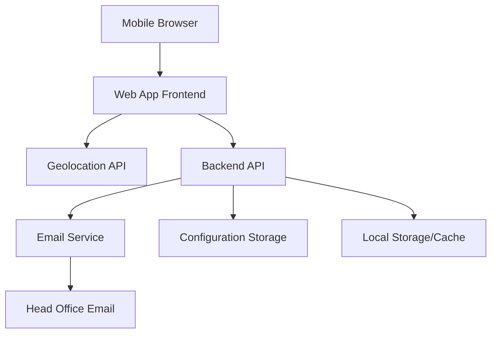

# Design Document

## Overview

The Capital Fire and Security mobile sign-in web application is a responsive web app that enables field employees to check in using their mobile browsers. The application captures GPS location, timestamps, and automatically emails this information to head office. The design prioritizes mobile-first responsive design, cross-browser compatibility, and secure data handling.

## Architecture

### High-Level Architecture



### Technology Stack

**Frontend:**
- HTML5 with responsive design
- CSS3 with mobile-first approach using Capital Fire and Security branding
- Vanilla JavaScript or lightweight framework (React/Vue.js)
- Progressive Web App (PWA) capabilities for offline functionality

**Backend:**
- Node.js with Express.js or Python with Flask/FastAPI
- RESTful API architecture
- Email service integration (SendGrid, AWS SES, or SMTP)

**Storage:**
- Configuration data: JSON files or lightweight database (SQLite)
- Local browser storage for offline capability
- Session storage for temporary data

## Components and Interfaces

### Frontend Components

#### 1. Sign-In Interface Component
- **Purpose:** Main user interface for employee check-in
- **Features:**
  - Capital Fire and Security branded header with logo
  - Employee identification input (name/ID)
  - Large, touch-friendly "Sign In" button
  - Status indicators for location and email sending
  - Error/success message display area

#### 2. Location Service Component
- **Purpose:** Handle browser geolocation API interactions
- **Features:**
  - Request location permissions
  - Capture GPS coordinates (latitude/longitude)
  - Handle location errors and timeouts
  - Display location status to user

#### 3. Email Service Component
- **Purpose:** Send sign-in data to head office
- **Features:**
  - Format email with employee data, location, and timestamp
  - Handle email sending with retry logic
  - Queue failed emails for retry when connection restored

#### 4. Configuration Component
- **Purpose:** Manage app settings and head office email configuration
- **Features:**
  - Admin interface for email settings
  - Validation of email addresses
  - Test email functionality
  - Secure storage of configuration

### Backend API Endpoints

#### POST /api/signin
- **Purpose:** Process employee sign-in
- **Input:** Employee ID/name, location coordinates, timestamp
- **Output:** Success/failure status, email confirmation
- **Security:** Input validation, rate limiting

#### GET/POST /api/config
- **Purpose:** Manage configuration settings
- **Input:** Email settings, head office contacts
- **Output:** Current configuration or update confirmation
- **Security:** Admin authentication required

#### POST /api/test-email
- **Purpose:** Test email configuration
- **Input:** Test email parameters
- **Output:** Email delivery status

## Data Models

### Sign-In Record
```javascript
{
  id: "unique-identifier",
  employeeId: "string",
  employeeName: "string", 
  location: {
    latitude: "number",
    longitude: "number",
    accuracy: "number"
  },
  timestamp: "ISO-8601-datetime",
  emailSent: "boolean",
  emailSentAt: "ISO-8601-datetime",
  retryCount: "number"
}
```

### Configuration Model
```javascript
{
  headOfficeEmail: "email-address",
  smtpSettings: {
    host: "string",
    port: "number",
    secure: "boolean",
    auth: {
      user: "string",
      pass: "encrypted-string"
    }
  },
  emailTemplate: {
    subject: "string",
    bodyTemplate: "string"
  },
  appSettings: {
    locationTimeout: "number",
    retryAttempts: "number",
    offlineMode: "boolean"
  }
}
```

## Branding and UI Design

### Capital Fire and Security Branding
Based on their website (https://www.capitalfireandsecurity.ca/):
- **Primary Colors:** Professional blue and red color scheme
- **Typography:** Clean, professional fonts suitable for mobile
- **Logo:** Capital Fire and Security logo prominently displayed
- **Design Language:** Professional, trustworthy, security-focused aesthetic

### Mobile-First Responsive Design
- **Breakpoints:** 
  - Mobile: 320px - 768px
  - Tablet: 768px - 1024px
  - Desktop: 1024px+
- **Touch Targets:** Minimum 44px for all interactive elements
- **Typography:** Scalable fonts with good contrast ratios
- **Loading States:** Clear indicators for location capture and email sending

## Error Handling

### Location Errors
- **Permission Denied:** Clear message explaining need for location access
- **Position Unavailable:** Fallback options or manual location entry
- **Timeout:** Retry mechanism with user feedback
- **Accuracy Issues:** Warning if location accuracy is poor

### Email Errors
- **Network Failure:** Queue for retry when connection restored
- **SMTP Errors:** Log errors and notify admin
- **Configuration Issues:** Clear error messages for setup problems
- **Rate Limiting:** Prevent spam with reasonable limits

### Browser Compatibility
- **Unsupported Features:** Graceful degradation for older browsers
- **JavaScript Disabled:** Basic functionality with server-side processing
- **Offline Mode:** Local storage with sync when online

## Testing Strategy

### Unit Testing
- Location service functions
- Email formatting and validation
- Configuration management
- Data model validation

### Integration Testing
- Browser geolocation API integration
- Email service integration
- Backend API endpoints
- Cross-browser compatibility

### User Acceptance Testing
- Mobile device testing (iOS Safari, Android Chrome)
- Location accuracy verification
- Email delivery confirmation
- Offline/online mode transitions

### Security Testing
- Input validation and sanitization
- HTTPS enforcement
- Secure storage of credentials
- Rate limiting effectiveness

## Security Considerations

### Data Protection
- HTTPS enforcement for all communications
- Encryption of sensitive configuration data
- Secure storage of email credentials
- Input validation and sanitization

### Privacy
- Minimal location data retention
- Clear privacy policy for location usage
- Option to delete historical data
- Compliance with privacy regulations

### Access Control
- Admin authentication for configuration
- Rate limiting to prevent abuse
- Session management for admin access
- Audit logging for configuration changes